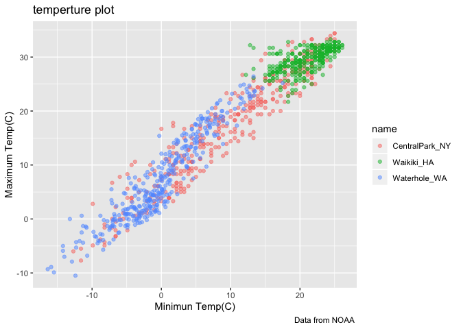
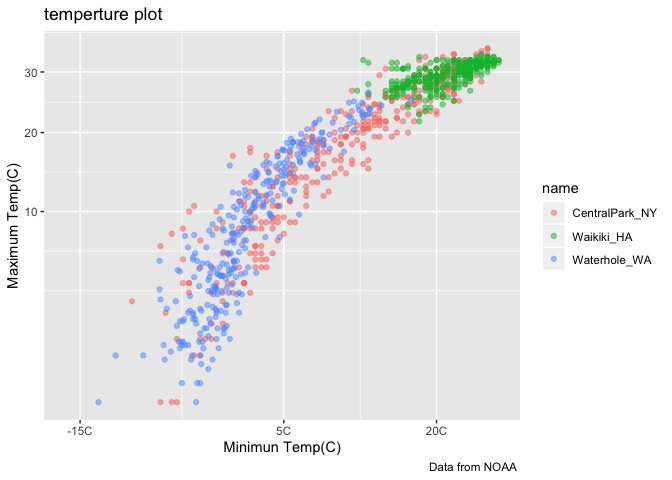
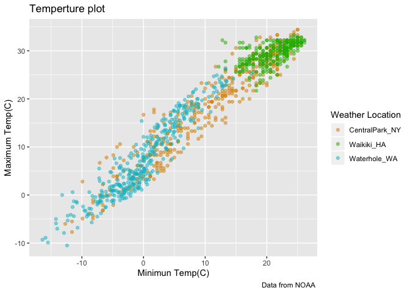
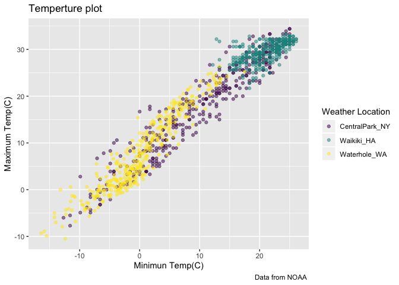

ggplot2
================
Keyi Wang
10/7/2019

``` r
weather_df = 
  rnoaa::meteo_pull_monitors(c("USW00094728", "USC00519397", "USS0023B17S"),
                      var = c("PRCP", "TMIN", "TMAX"), 
                      date_min = "2017-01-01",
                      date_max = "2017-12-31") %>%
  mutate(
    name = recode(id, USW00094728 = "CentralPark_NY", 
                      USC00519397 = "Waikiki_HA",
                      USS0023B17S = "Waterhole_WA"),
    tmin = tmin / 10,
    tmax = tmax / 10) %>%
  select(name, id, everything())
```

    ## Registered S3 method overwritten by 'crul':
    ##   method                 from
    ##   as.character.form_file httr

    ## Registered S3 method overwritten by 'hoardr':
    ##   method           from
    ##   print.cache_info httr

    ## file path:          /Users/wangkeyi/Library/Caches/rnoaa/ghcnd/USW00094728.dly

    ## file last updated:  2019-10-07 13:18:52

    ## file min/max dates: 1869-01-01 / 2019-10-31

    ## file path:          /Users/wangkeyi/Library/Caches/rnoaa/ghcnd/USC00519397.dly

    ## file last updated:  2019-10-07 13:19:11

    ## file min/max dates: 1965-01-01 / 2019-10-31

    ## file path:          /Users/wangkeyi/Library/Caches/rnoaa/ghcnd/USS0023B17S.dly

    ## file last updated:  2019-10-07 13:19:18

    ## file min/max dates: 1999-09-01 / 2019-10-31

making new plots

``` r
weather_df %>%
  ggplot(aes(x=tmin,y=tmax,color = name))+
  geom_point(alpha = 0.5)+
  labs(
    title = "temperture plot",
    x = "Minimun Temp(C)",
    y ="Maximum Temp(C)",
    caption = "Data from NOAA "
  )
```

    ## Warning: Removed 15 rows containing missing values (geom_point).

<!-- -->

x axis tick marks–scaling

``` r
weather_df %>%
  ggplot(aes(x=tmin,y=tmax,color = name))+
  geom_point(alpha = 0.5)+
  labs(
    title = "temperture plot",
    x = "Minimun Temp(C)",
    y ="Maximum Temp(C)",
    caption = "Data from NOAA "
  ) +
  scale_x_continuous(
    breaks = c(-15,5,20),
    labels  = c("-15C","5C","20C")
  )+
  scale_y_continuous(
    trans = "sqrt"
  ) ### = scale_y_sqrt()
```

    ## Warning in self$trans$transform(x): NaNs produced

    ## Warning: Transformation introduced infinite values in continuous y-axis

    ## Warning: Removed 90 rows containing missing values (geom_point).

<!-- -->

\#\#colors

``` r
weather_df %>%
  ggplot(aes(x = tmin,y = tmax,color = name)) +
  geom_point(alpha = 0.5) +
  labs(
    title = "Temperture plot",
    x = "Minimun Temp(C)",
    y = "Maximum Temp(C)",
    caption = "Data from NOAA "
  ) +
  scale_color_hue(
    name = "Weather Location",
    h = c(50,200)
    
  )
```

    ## Warning: Removed 15 rows containing missing values (geom_point).

<!-- -->

viridis\!

``` r
ggp_base = weather_df %>%
  ggplot(aes(x = tmin,y = tmax,color = name)) +
  geom_point(alpha = 0.5) +
  labs(
    title = "Temperture plot",
    x = "Minimun Temp(C)",
    y = "Maximum Temp(C)",
    caption = "Data from NOAA "
  ) +
  viridis::scale_color_viridis(
    name = "Weather Location", 
    discrete = TRUE
  )
ggp_base
```

    ## Warning: Removed 15 rows containing missing values (geom_point).

<!-- -->
