ggplot2
================
Keyi Wang
10/7/2019

``` r
weather_df = 
  rnoaa::meteo_pull_monitors(c("USW00094728", "USC00519397", "USS0023B17S"),
                      var = c("PRCP", "TMIN", "TMAX"), 
                      date_min = "2017-01-01",
                      date_max = "2017-12-31") %>%
  mutate(
    name = recode(id, USW00094728 = "CentralPark_NY", 
                      USC00519397 = "Waikiki_HA",
                      USS0023B17S = "Waterhole_WA"),
    tmin = tmin / 10,
    tmax = tmax / 10) %>%
  select(name, id, everything())
```

    ## Registered S3 method overwritten by 'crul':
    ##   method                 from
    ##   as.character.form_file httr

    ## Registered S3 method overwritten by 'hoardr':
    ##   method           from
    ##   print.cache_info httr

    ## file path:          /Users/wangkeyi/Library/Caches/rnoaa/ghcnd/USW00094728.dly

    ## file last updated:  2019-10-07 13:18:52

    ## file min/max dates: 1869-01-01 / 2019-10-31

    ## file path:          /Users/wangkeyi/Library/Caches/rnoaa/ghcnd/USC00519397.dly

    ## file last updated:  2019-10-07 13:19:11

    ## file min/max dates: 1965-01-01 / 2019-10-31

    ## file path:          /Users/wangkeyi/Library/Caches/rnoaa/ghcnd/USS0023B17S.dly

    ## file last updated:  2019-10-07 13:19:18

    ## file min/max dates: 1999-09-01 / 2019-10-31

making new plots

``` r
weather_df %>%
  ggplot(aes(x=tmin,y=tmax,color = name))+
  geom_point(alpha = 0.5)+
  labs(
    title = "temperture plot",
    x = "Minimun Temp(C)",
    y ="Maximum Temp(C)",
    caption = "Data from NOAA "
  )
```

    ## Warning: Removed 15 rows containing missing values (geom_point).

<!-- -->

x axis tick marks–scaling

``` r
weather_df %>%
  ggplot(aes(x=tmin,y=tmax,color = name))+
  geom_point(alpha = 0.5)+
  labs(
    title = "temperture plot",
    x = "Minimun Temp(C)",
    y ="Maximum Temp(C)",
    caption = "Data from NOAA "
  ) +
  scale_x_continuous(
    breaks = c(-15,5,20),
    labels  = c("-15C","5C","20C")
  )+
  scale_y_continuous(
    trans = "sqrt"
  ) ### = scale_y_sqrt()
```

    ## Warning in self$trans$transform(x): NaNs produced

    ## Warning: Transformation introduced infinite values in continuous y-axis

    ## Warning: Removed 90 rows containing missing values (geom_point).

<!-- -->

\#\#colors

``` r
weather_df %>%
  ggplot(aes(x = tmin,y = tmax,color = name)) +
  geom_point(alpha = 0.5) +
  labs(
    title = "Temperture plot",
    x = "Minimun Temp(C)",
    y = "Maximum Temp(C)",
    caption = "Data from NOAA "
  ) +
  scale_color_hue(
    name = "Weather Location",
    h = c(50,200)
    
  )
```

    ## Warning: Removed 15 rows containing missing values (geom_point).

<!-- -->

viridis\!

``` r
ggp_base = weather_df %>%
  ggplot(aes(x = tmin,y = tmax,color = name)) +
  geom_point(alpha = 0.5) +
  labs(
    title = "Temperture plot",
    x = "Minimun Temp(C)",
    y = "Maximum Temp(C)",
    caption = "Data from NOAA "
  ) +
  viridis::scale_color_viridis(
    name = "Weather Location", 
    discrete = TRUE
  )
ggp_base
```

    ## Warning: Removed 15 rows containing missing values (geom_point).

<!-- -->

\#\#themes

``` r
ggp_base +
theme(legend.position = "bottom" )
```

    ## Warning: Removed 15 rows containing missing values (geom_point).

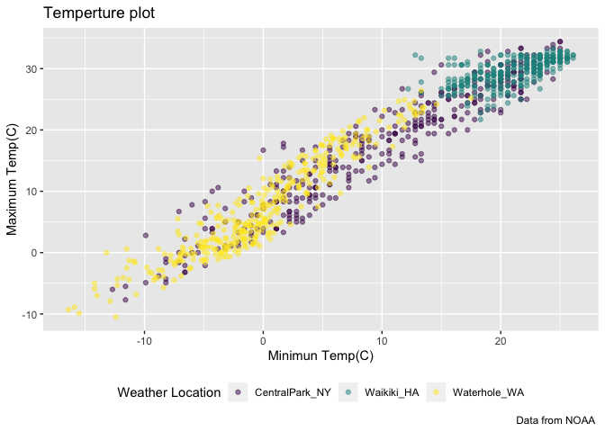<!-- -->

``` r
ggp_base +
theme_bw()+
theme(legend.position = "bottom" )
```

    ## Warning: Removed 15 rows containing missing values (geom_point).

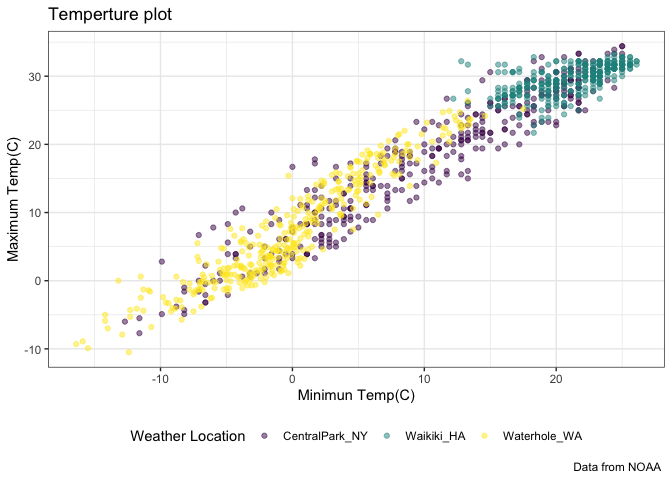<!-- -->

more than one dataset

``` r
central_park =
  weather_df%>%
  filter(name == "CentralPark_NY")

waikiki = 
  weather_df %>%
  filter(name == "Waikiki_HA")

ggplot(data = waikiki,aes(x = date,y = tmax,color = name))+
  geom_point() +
  geom_line(data = central_park) ### adding data for central park
```

    ## Warning: Removed 3 rows containing missing values (geom_point).

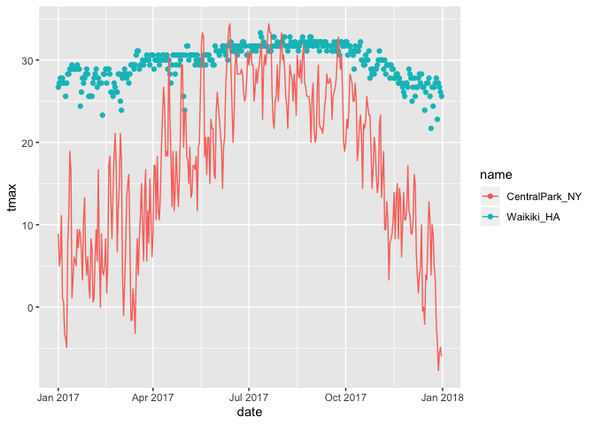<!-- -->

breif aside about colors

``` r
waikiki%>%
  ggplot(aes(x = date, y = tmax, color = name)) +
  geom_point(color = "blue")
```

    ## Warning: Removed 3 rows containing missing values (geom_point).

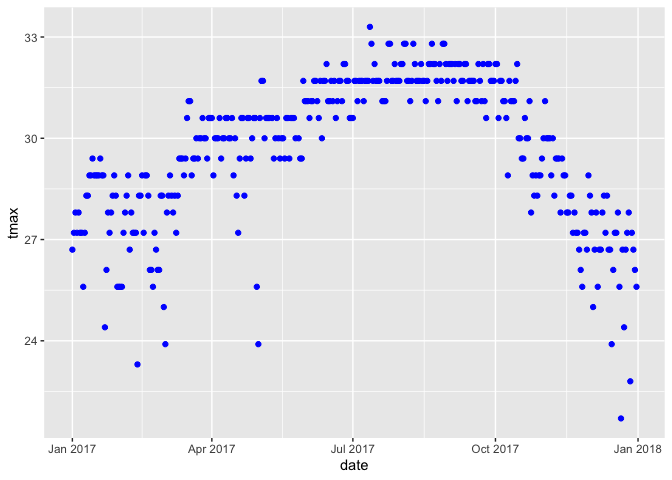<!-- -->

\#\#multi-panel plots

``` r
ggp_scatter = 
  weather_df %>%
  ggplot(aes(x = tmin,y = tmax)) +
  geom_point()

ggp_density = 
  weather_df %>%
  ggplot(aes(x = tmin)) +
  geom_density()
  
  ggp_box = 
  weather_df %>%
  ggplot(aes(x = name,y = tmax)) +
  geom_boxplot()
  
  (ggp_scatter+ggp_density)/ggp_box ### using patchwork to put plots together
```

    ## Warning: Removed 15 rows containing missing values (geom_point).

    ## Warning: Removed 15 rows containing non-finite values (stat_density).

    ## Warning: Removed 3 rows containing non-finite values (stat_boxplot).

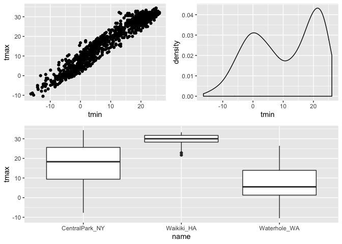<!-- -->

data manipulation

``` r
## change the order of location
 weather_df %>%
  mutate(
    name = factor(name),
    name = fct_relevel(name,"Waikiki_HA","CentralPark_NY") 
    ## waikiki appears first in plot
  ) %>%
  ggplot(aes(x = name,y = tmax, color = name)) +
  geom_boxplot()
```

    ## Warning: Removed 3 rows containing non-finite values (stat_boxplot).

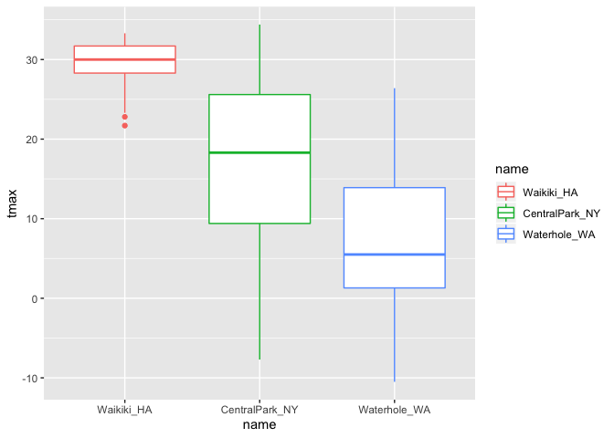<!-- -->

reorder instead of relevel

``` r
 weather_df %>%
  mutate(
    name = factor(name),
    name = fct_reorder(name,tmax) 
    ## order based on tmax since waterhole has the lowest tmax, it appears first
  ) %>%
  ggplot(aes(x = name,y = tmax, color = name)) +
  geom_boxplot()
```

    ## Warning: Removed 3 rows containing non-finite values (stat_boxplot).

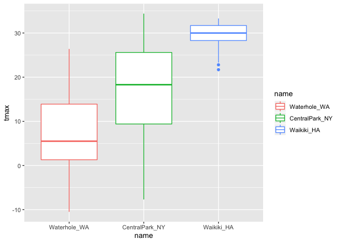<!-- -->

``` r
weather_df %>%
  mutate(
    name = factor(name),
    name = fct_relevel(name,"Waterhole_WA","Waikiki_HA") 
    ## waikiki appears first in plot
  ) %>%
  ggplot(aes(x = tmin, y = tmax, color = name))+
  geom_point()
```

    ## Warning: Removed 15 rows containing missing values (geom_point).

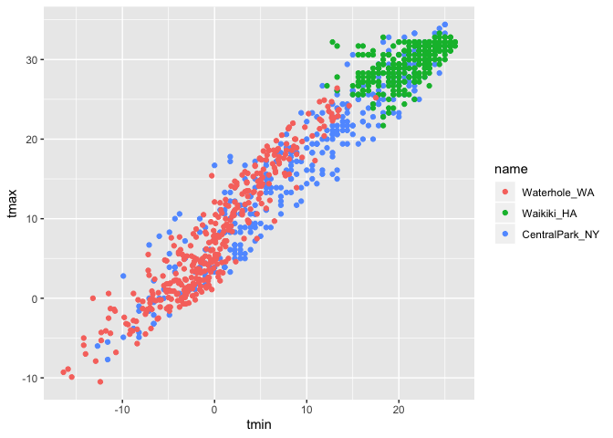<!-- -->

## restructure then plot

``` r
weather_df %>%
  pivot_longer(
    tmax:tmin,
    names_to = "observation",
    values_to = "temperture"
  )%>%
ggplot(aes(x=temperture,fill = observation))+
  geom_density(alpha = 0.5)+
  facet_grid(~name)+
  theme(legend.position = "bottom")
```

    ## Warning: Removed 18 rows containing non-finite values (stat_density).

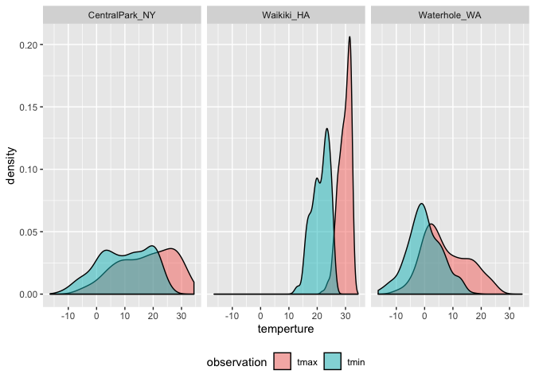<!-- -->

``` r
pup_data = 
  read_csv("./data/FAS_pups.csv", col_types = "ciiiii") %>%
  janitor::clean_names() %>%
  mutate(sex = recode(sex, `1` = "male", `2` = "female")) 

litter_data = 
  read_csv("./data/FAS_litters.csv", col_types = "ccddiiii") %>%
  janitor::clean_names() %>%
  select(-pups_survive) %>%
  separate(group, into = c("dose", "day_of_tx"), sep = 3) %>%
  mutate(wt_gain = gd18_weight - gd0_weight,
         day_of_tx = as.numeric(day_of_tx))
fas_data = left_join(pup_data, litter_data, by = "litter_number") 

## wheather the dose or day of treatment has impact on previous factors
fas_data %>%
  drop_na()%>%
  ggplot(aes(x = dose, y = pd_ears ))+
  geom_violin()+
  facet_grid(day_of_tx ~.) ### day of treatment against everything else
```

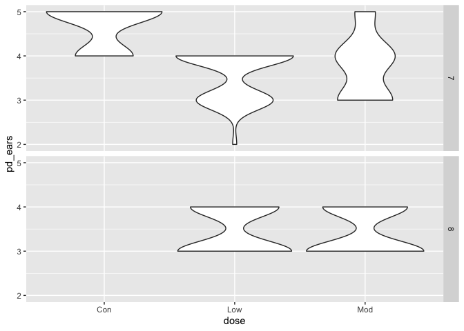<!-- -->

``` r
fas_data %>%
  pivot_longer(
    pd_ears:pd_walk,
    names_to = "outcome",
    values_to = "pn_day"
  ) %>%
    drop_na(dose, day_of_tx,pn_day) %>% 
  mutate(
    outcome = factor(outcome),
    outcome = fct_reorder(outcome, pn_day)
  )%>%
  ggplot(aes(x = dose, y = pn_day ))+
  geom_violin()+
  facet_grid(day_of_tx ~ outcome)
```

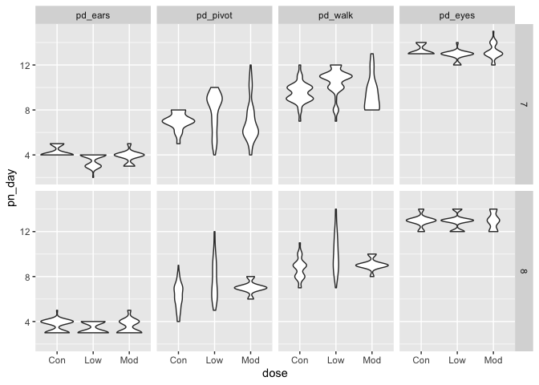<!-- -->

``` r
## think about tidying the data
```
